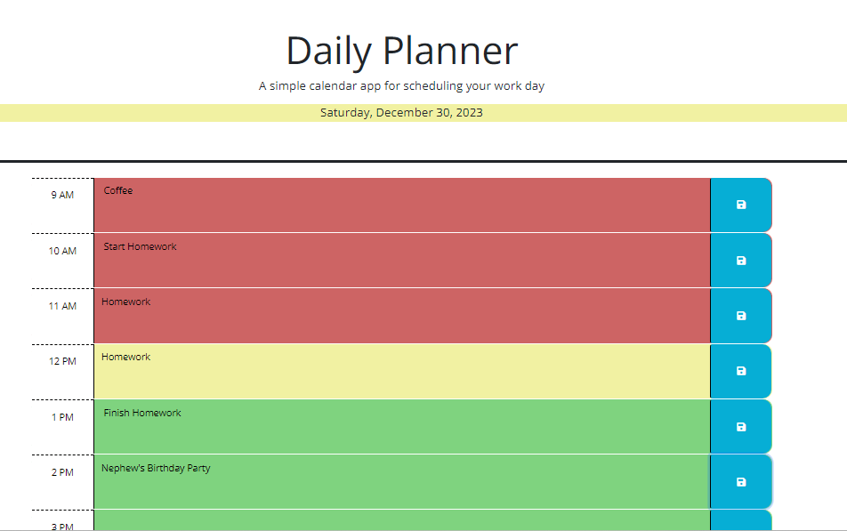

# Daily Planner

## Description

This project was to create a calendar application using starter code. It is a tool that is best used to plan your work day between the hours of 9 am and 5 pm. The timeblocks change colors depending on whether that time is past, present or future. The user can input their tasks and save them so when the page refreshes, their task for that hour still appears. 

## Usage

Screenshot:

Link:
https://ebcoleman.github.io/daily-planner/

## Credits

Starter code:
https://git.bootcampcontent.com/Michigan-State-University/MSU-VIRT-FSF-PT-11-2023-U-LOLC.git

<!-- examples -->
https://www.james-fisher-web-developer.com/pages/workday-scheduler.html
https://github.com/Sarah-Safarzadeh/work-day-scheduler
https://www.youtube.com/watch?v=sm6py49QNto
https://github.com/ThomasCalle/Online-Workday-Planner/blob/main/assets/script.js
